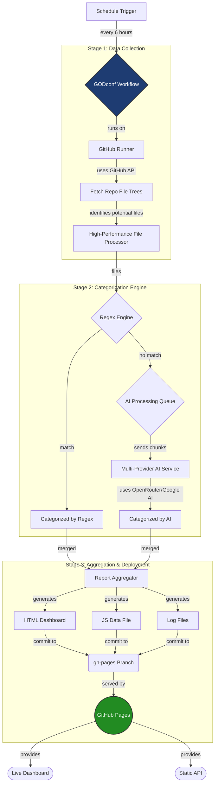

# GODconf v1.0

An intelligent, fully-automated, and resilient configuration scanner that discovers, categorizes, and aggregates public configuration links from various GitHub repositories using a sophisticated multi-stage pipeline powered by Regex and Artificial Intelligence.

The system is designed to run autonomously on a schedule, publishing its findings as a clean, structured Static API and a comprehensive visual dashboard.

---

### ✨ Key Features

-   **🤖 Dual-Engine Categorization:** Utilizes a powerful combination of high-speed Regex for common patterns and advanced AI (via OpenRouter & Google AI) for complex, uncategorized files.
-   **🚀 Fully Automated CI/CD:** Leverages GitHub Actions for a zero-maintenance, scheduled execution pipeline. It runs, reports, and deploys without any manual intervention.
-   **🌐 Static API Generation:** Publishes categorized data as a structured JavaScript file, making it easily consumable by any other web application or service.
-   **📊 Executive Dashboard:** Automatically generates a rich, interactive HTML dashboard (`Visual_Report.html`) with KPIs, charts, and detailed breakdowns of each scan.
-   **🛡️ Resilient & Scalable:** Built with resilience in mind, featuring API provider fallbacks, request retries, and a multi-threaded architecture to handle thousands of files efficiently.
-   **🔑 Secure by Design:** Manages all API keys securely using GitHub Secrets, ensuring no sensitive information is ever exposed in the codebase.
-   **🧹 Clean Architecture:** Enforces a strict separation between source code (in the `main` branch) and published artifacts (in the `gh-pages` branch), maintaining a clean and professional repository history.

---

### 🚀 Live Demo & Output

The GODconf scanner runs automatically every 6 hours. You can access the latest results here:

-   **📊 Interactive Dashboard:** **[Visual_Report.html](https://ham3d-s.github.io/GODconf/Visual_Report.html)**
-   **📦 Static API Data File:** **[public-configs-data.js](https://ham3d-s.github.io/GODconf/public-configs-data.js)**

---

### 🏗️ Architectural Overview

GODconf operates on a sophisticated, multi-stage, serverless architecture orchestrated entirely by GitHub Actions.



---

### 🛠️ Technology Stack

-   **Core:** Python 3.11+
-   **Orchestration:** GitHub Actions
-   **AI Services:** Google Gemini, OpenRouter API
-   **APIs & Libraries:** `requests`, `openai`, `google-generativeai`, `tqdm`, `python-json-logger`
-   **Deployment:** GitHub Pages
-   **Data Format:** JSON, JavaScript

---

### ⚙️ How It Works

1.  **Trigger:** A GitHub Actions workflow is triggered on a schedule (e.g., every 6 hours) or can be run manually.
2.  **Setup:** A clean Ubuntu runner is provisioned, Python is set up, and all dependencies are installed.
3.  **Scan (`main.py`):**
    -   The script reads the list of target repositories from `repos.txt`.
    -   For each repository, it fetches the entire file tree recursively.
    -   It filters for potential configuration files based on extensions and blacklisted keywords.
    -   Using a thread pool, it processes each file.
4.  **Categorization:**
    -   **Regex First:** Each file path is first tested against a series of pre-defined regular expressions in `config.json`. If a match is found, it's categorized instantly.
    -   **AI Fallback:** If no regex pattern matches, the file metadata is added to a queue for AI processing.
    -   The AI categorizer batches these items and sends them to the configured AI providers, with a fallback mechanism if the primary provider fails.
5.  **Aggregation & Reporting:**
    -   All categorized data (from both Regex and AI) is merged into a single, structured dictionary.
    -   The `ReportAggregator` generates the final output files:
        -   `Visual_Report.html`: The interactive dashboard.
        -   `public-configs-data.js`: The "Static API" file.
        -   `Execution_Report.log`: A human-readable text summary.
        -   `run_*.log`: A structured JSON log for machine analysis.
6.  **Deployment:**
    -   The `peaceiris/actions-gh-pages` action takes the entire `reports/` directory and commits it to the `gh-pages` branch, overwriting the previous contents.
    -   GitHub Pages automatically serves the content of the `gh-pages` branch as a public website.

---

### 🚀 Using the Static API

The primary output of this project is the `public-configs-data.js` file, which acts as a simple, reliable, and free-to-host API. You can consume this data in any modern JavaScript application.

**Example `fetch` in JavaScript:**
```javascript
async function getGodconfData() {
  try {
    // Dynamically import the JS module from the GitHub Pages URL
    const dataModule = await import('https://ham3d-s.github.io/GODconf/public-configs-data.js');
    
    // Access the exported data object
    const configs = dataModule.INITIAL_PUBLIC_CONFIGS;

    console.log('Successfully fetched GODconf data:', configs);
    
    // Now you can work with the structured data
    // For example, to get data from a specific repository:
    const specificRepoData = configs['Itsyebekhe-Psg'];
    if (specificRepoData) {
      console.log('Data for itsyebekhe/PSG:', specificRepoData);
    }

  } catch (error) {
    console.error('Failed to fetch GODconf data:', error);
  }
}

getGodconfData();
```

---

### 📜 License

This project is released under a custom license. Please see the [LICENSE](LICENSE) file for details.

**TL;DR:**
-   ✔️ **Free for personal, non-commercial use, and testing.**
-   ❌ **Requires permission for any commercial use or revenue-generating activities.**
-   🙏 **Attribution is required.** If you use this project or any part of it, you must credit the original author and link back to this repository.

---

### 👤 Contact

Created by **Ham3d-s**.
If you have questions, or require permission for commercial use, please open an issue in this repository.

